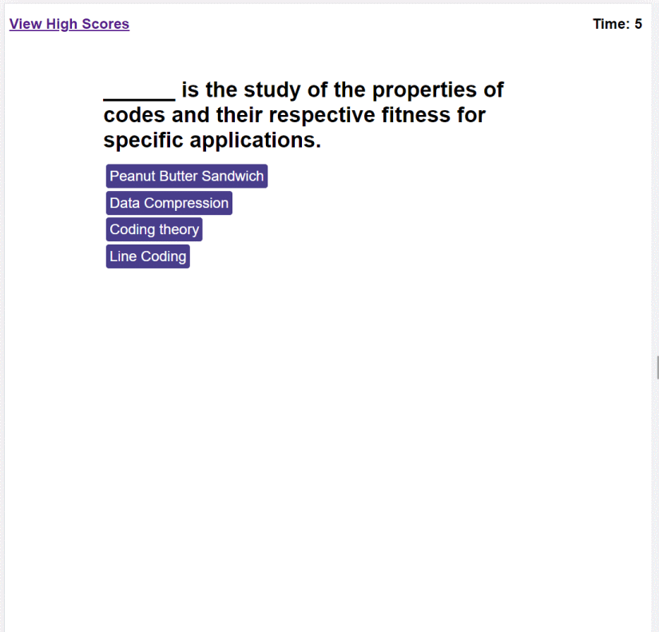

# DU-HW4-Code-Quiz

DU Coding Bootcamp Homework 4: Code Quiz

# Website

This is a website with dynamically updated content via JavaScript.

Public Website Address: https://gittinit6.github.io/DU-HW4-Code-Quiz/

## Purpose

This website is specific to anyone that wants to test their knowledge of coding by taking a short quiz.
* The functionality will show wether or not the selected answer is correct.
* There are 4 multiple choice answers provided per question.
* The questions are randomly selected from a pool of questions stored in an array in JS.

## Audience

The intended audience is an individual that would have a need for a short coding quiz. The user of this site does not need to have a technical background, but *should* understand some technical terms due to the topic of the quiz (i.e. HTML, JavaScript, jQuery, etc. )

## Technical Detail

This website uses HTML with an external linked CSS for style and external linked JavaScript code for functionality.

**Responsive Design:** This website is designed to be responsive to smaller screens.

The files are configured as follows:
```
Root Directory
│
│ --index.html
│
└───assets (folder)
    │
    └─── css (folder containing css style files)
    │
    └─── images (folder containing all image resources)
    │
    └─── scripts (folder containing JavaScript files)
```
>**CSS**: This site uses a single CSS file "style.css"

>**JavaScript**: This site uses a single JavaScript file "script.js"

The following image shows a screenshot of the website homepage:



## Revision History 

1. This website was created in January 2022 as part of a bootcamp assignment. It was created from scratch by the author using Visual Studio Code.